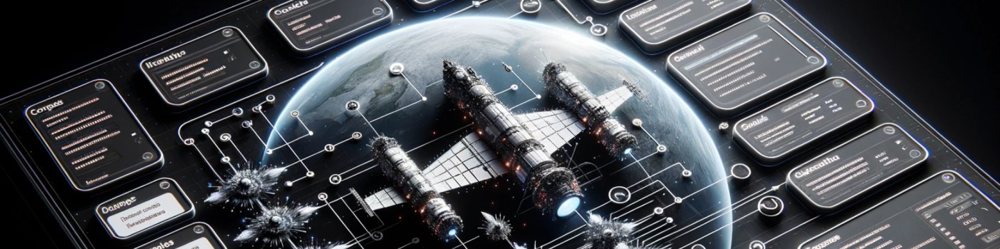

<h1 align="center"><b>Hi , I'm Joaquim Silveira </b></h1>

  

## <picture></picture> **About me**

   

    

      
Roboticist and Software Freak specializing in Mobile Robotics with a minor in Computer Science. Former Vice-President and Flight Software engineer at EPFL's SpaceCraft Team for the CHESS mission. Founding Member and Lead Software Engineer of DPhi Space.

    

    

      
    

  

## <b> Skills</b>
 

- **Languages**:
    
    
    
    
    
    
    
 

- **Softwares and Tools**:

    
    
    
    
     
     
     
     

 

- **Extras**:

    
       

## <b> Github Stats </b>
 

##  <b> Let's Connect..!</b>
 
  

  
  
  

  

##  <b> Favourite Books</b>
